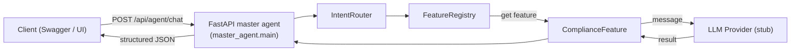

# FairWorkly Agent v0

FastAPI service that exposes a lightweight "master agent" endpoint. Incoming requests are routed to feature slices (currently a placeholder Compliance feature). The shared package already contains scaffolding for LLM providers, prompts, file handlers, and future RAG integrations.

## Setup

### Prerequisites

1. Python 3.10 or newer
2. [Poetry](https://python-poetry.org/) for dependency management

### Install dependencies

```bash
cd agent-service
poetry install
```

Copy the example environment configuration and populate the secrets you want to use (e.g., OpenAI credentials once the provider is wired up):

```bash
cp .env.example .env
# edit .env so OPENAI_API_KEY has a real value
```

## Run

Start the FastAPI server with Uvicorn via Poetry:

```bash
poetry run uvicorn master_agent.main:app --reload --port 8000
```

The root route (`/`) redirects to Swagger, so opening `http://localhost:8000/` immediately shows the API docs.

## Run Tests

No automated tests ship yet. If you add any under `tests/`, run them with:

```bash
poetry run pytest
```

## Manual Testing

### 1. Open Swagger UI

Visit:

```
http://localhost:8000/docs
```

### 2. Exercise the master agent endpoint

1. In Swagger, expand **POST /api/agent/chat**.
2. Click **Try it out**.
3. Provide a message and (optionally) upload a file.
4. Execute and verify that the payload is routed to the compliance placeholder feature (the response shows which feature handled the request).

## Directory structure

```
agent-service/
├── .env.example                # Template for API keys
├── pyproject.toml              # Poetry configuration
├── master_agent/               # FastAPI entry point + shared registry
│   ├── main.py                 # Uvicorn target (master_agent.main:app)
│   ├── intent_router.py        # Naive router to choose feature
│   ├── feature_registry.py     # Registers and resolves features
│   └── demo_feature.py         # Sample feature implementations
├── agents/
│   ├── compliance/             # Compliance feature slice
│   │   └── compliance_feature.py
│   └── shared/                 # Utilities shared across features
│       ├── file_handler.py     # File parsing scaffolding
│       ├── prompt_builder_base.py
│       ├── rag_retriever.py    # Future RAG integration hooks
│       └── llm/                # Provider abstractions (Azure/OpenAI stubs)
└── README.md
```

## Data flow overview

